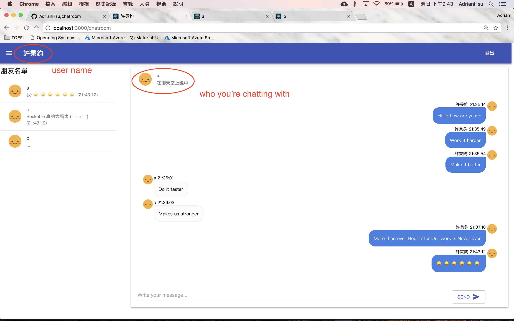
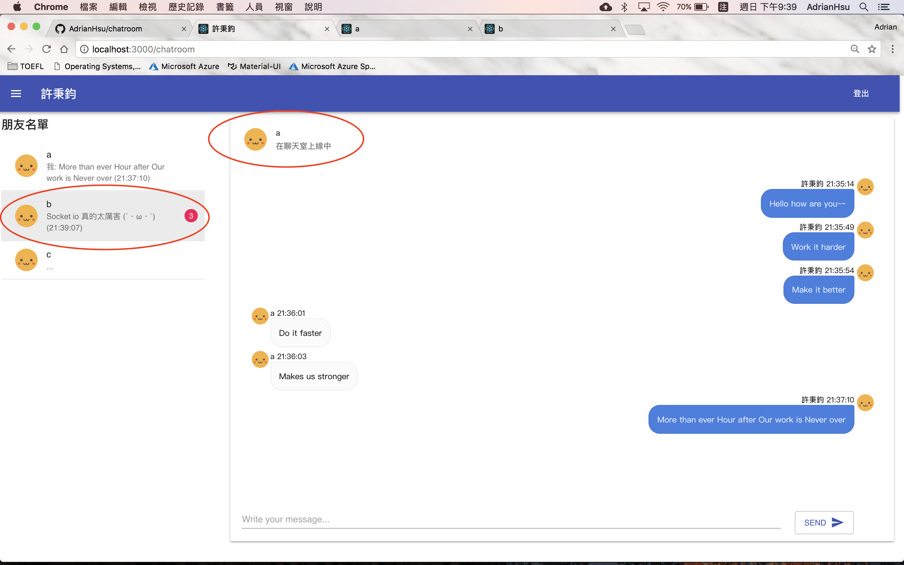
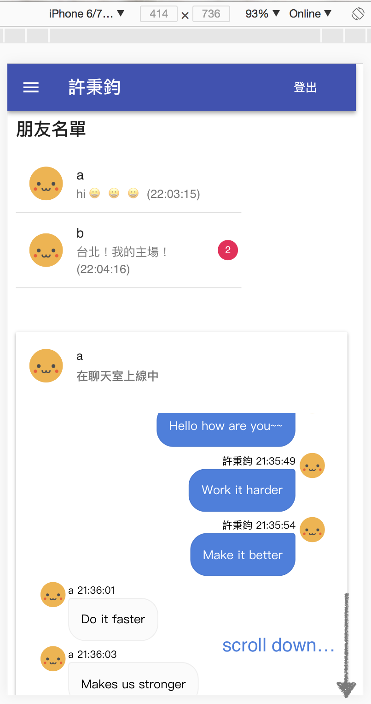
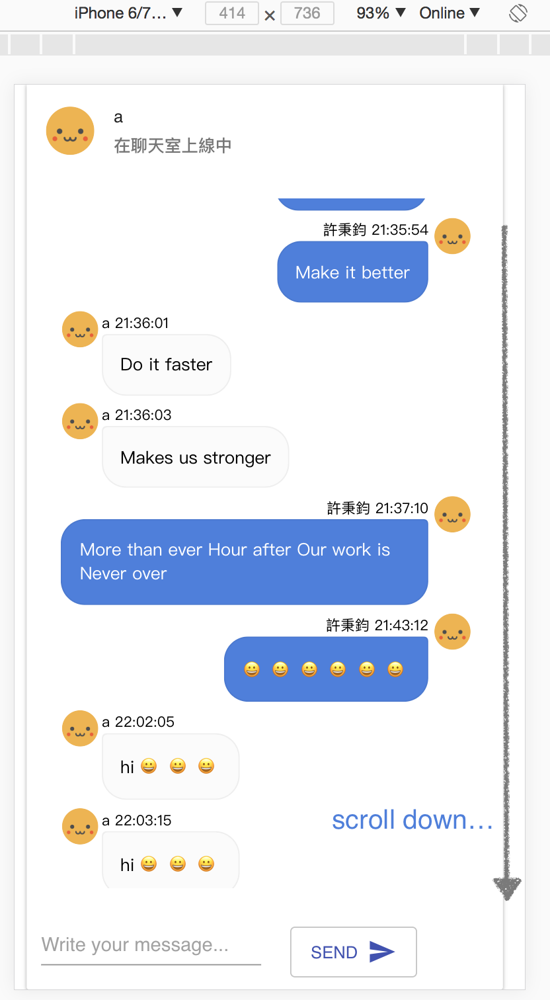
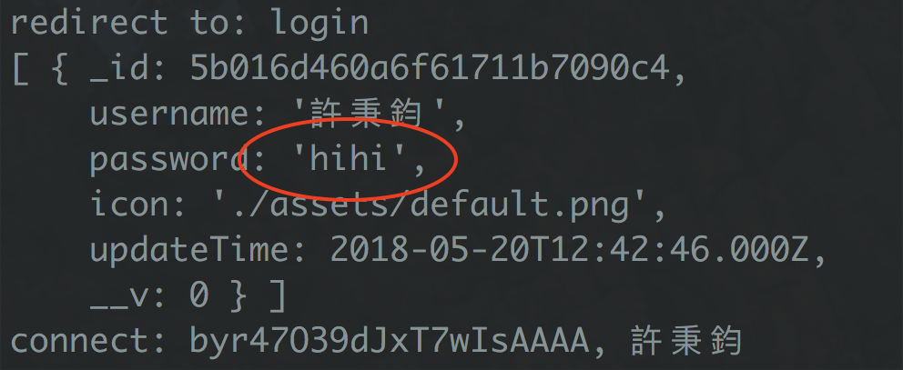

# chatroom

> 🏃 Let's chat with your friends.


<p align=center>
<a target="_blank" href="https://npmjs.org/package/life-commit" title="NPM version"></a><a target="_blank" href="http://nodejs.org/download/" title="Node version"></a><a target="_blank" href="https://opensource.org/licenses/MIT" title="License: MIT"></a><a target="_blank" href="http://makeapullrequest.com" title="PRs Welcome"></a>
</p>  


- Front-end Framework: **React, React-dom**
- Front-end Ajax communication: **axios, socket.io-client**
- Front-end Web RWD Design: **Material-ui, livechat-ui**
- Back-end: **Node.js, Express.js, Socket.io**
- Database: **Mongoose, MongoDB**
- Bundle: **Webpack, Babel**


## How-to

```Shell
$ npm install 
$ npm run build
$ npm run start 

# demo page: http://localhost:3000/
# demo page: https://adrianhsu.app/
```


## Directory Tree

```
$ tree
.
├── README.md
├── package-lock.json
├── package.json
├── public
│   ├── assets/
│   ├── chatroom.html
│   ├── login.html
│   └── signup.html
├── server.js
├── src
│   ├── app
│   │   ├── ButtonAppBar.js
│   │   ├── ChatGridLayout.js
│   │   ├── ChatRoomLayout.js
│   │   ├── ChatRoomPaper.js
│   │   ├── ContactList.js
│   │   ├── InputBox.js
│   │   ├── Login.js
│   │   ├── SignUp.js
│   │   ├── index_chatroom.js
│   │   ├── index_login.js
│   │   └── index_signup.js
│   ├── models
│   │   ├── Message.js
│   │   └── User.js
│   └── socket
│       ├── MessageSocket.js
│       └── UserSocket.js
└── webpack.config.js

6 directories, 34 files
```


## Required global packages

Since that some of my packages are installed **globally**, so you might need to install them yourselves.

```shell
$ npm install -g nodemon@1.17.4
$ sudo yum install -y mongodb-org # version: 3.6
```


## Screenshot

1. Login Page: [http://localhost:3000/login](http://localhost:3000/login)


2. Sign Up Page: [http://localhost:3000/signup](http://localhost:3000/signup)


3. Chat room: [http://localhost:3000/chatroom](http://localhost:3000/chatroom)




4. Chat room (when someone send you messages)



5. RWD web design (compatible with iPhone 6/7 and android)

| mobile_1.png            | mobile_2.png            |
| ----------------------- | ----------------------- |
|  |  |

6. Server Logs

```Shell
received msg: { _id: 5b017a061a6ce3730da9a0ab,
  from: '許秉鈞', # I send messages
  to: 'a',
  msg: 'More than ever Hour after Our work is Never over',
  time: '21:37:10',
  timestamp: '1526823430410',
  __v: 0 }
received msg: { _id: 5b017a721a6ce3730da9a0ac,
  from: 'b', # someone send me messages
  to: '許秉鈞',
  msg: 'Socket io 真的太厲害 (´・ω・`)',
  time: '21:38:58',
  timestamp: '1526823538640',
  __v: 0 }
```


## Dependencies

* Front-end Framework: **React, React-dom**
* Front-end Ajax communication: **axios, socket.io-client**
* Front-end Web RWD Design: **Material-ui, livechat-ui**
* Back-end: **Node.js, Express.js, Socket.io**
* Database: **Mongoose, MongoDB**
* Bundle: **Webpack, Babel**


```
"dependencies": {
    "@babel/cli": "^7.0.0-beta.47",
    "@babel/core": "^7.0.0-beta.47",
    "@babel/plugin-proposal-class-properties": "^7.0.0-beta.47",
    "@babel/preset-env": "^7.0.0-beta.47",
    "@babel/preset-react": "^7.0.0-beta.47",
    "@livechat/ui-kit": "^0.1.0",
    "@material-ui/core": "^1.0.0-rc.1",
    "@material-ui/icons": "^1.0.0-rc.0",
    "axios": "^0.18.0",
    "babel-loader": "^8.0.0-beta.2",
    "body-parser": "^1.18.3",
    "express": "^4.16.3",
    "material-ui": "^0.20.1",
    "mongo": "^0.1.0",
    "mongoose": "^5.1.1",
    "mongoose-unique-validator": "^2.0.1",
    "react": "^16.3.2",
    "react-dom": "^16.3.2",
    "socket.io": "^2.1.1",
    "socket.io-client": "^2.1.1",
    "typeface-roboto": "0.0.54",
    "webpack": "^4.8.3",
    "webpack-cli": "^2.1.3"
  }
```


## Database

* MongoDB + Mongoose
* `mongoose-unique-validator` to check if the username is already used
* you can download the package through `npm install -S mongoose-unique-validator`


#### UserSchema

```javascript
const userSchema = mongoose.Schema({
  username: { type: String, required: true, unique: true }, # 許秉鈞
  password: { type: String, required: true }, # hihi
  icon: {type: String, required: true}, # './assets/default.png'
  updateTime: Date # ISODate("2018-05-20T08:41:18Z")
});
userSchema.plugin(uniqueValidator); # check username is unique
```


#### MessageSchema

```Javascript
const messageSchema = mongoose.Schema({
    from: String, # 許秉鈞
    to: String, # 許秉倫
    msg: String, # "How is your mid-term exam?"
    time: String, # "20:23:27" 
    timestamp: String # "1526819007387"
});
```

## Known Issues

1. When running the command  `npm run build`  it generates some warnings, as shown below (but they have no real effect on the compile process, so please just ignore them!)


2. **[IMPORTANT]** I didn't encrypt the password, and it's very dangerous.




## License

MIT License


## Main Feature

- Contact List
  - Show all Friends in the database who you could chat with
  - Once the particular user has been signed up, anyone could chat with him/her
  - highlight the friend who you're chat with
- Current friend you're chatting with
  - print the friend name and friend icon on the top bar
- Chatroom Layout
  - sort the messages by their timestamp
  - the newest message will be put in the button
  - print out the message, time, and name
  - messages from self will be on the right; messages from friends will be on the left
- Input text box
  - send button
  - key press "enter" will send also
  - prevent from sending empty message
- show username on the top bar (pink color bar), and also the **document title**
- support one-to-one messaging
  - open 2 pages in your browser, and you can use different users to chat to each other
- sign up: username + password
  - username is **unique**, so the name and socket id are mapped 1-to-1
  - password is not encryted, see **known issues**
- default user icon (yellow smile face)
- Logout button
- message notification (red badges)
  - When user A sending messages to user B, and user B is chatting with user C, for example, then the user B will get a notification from user A (red badges)
  - notification number will also be shown
- MongoDB database: `messagesdb`
  - there are 2 collections in this database: `User` and `Message`
- Supporting Front-end design frameworks: 
  - [Material UI](https://material-ui-next.com/)
  - [React chat ui kit](https://docs.livechatinc.com/react-chat-ui-kit)
- Back-end logging
  - if someone are chatting, the server will print out those messages passing through
- built-in Emoji


## To-do

1. upload images, videos
2. upload user icons
3. delete messages
4. Chatbot
5. search for messages
6. showing that someone is texting
7. Facebook or github login
